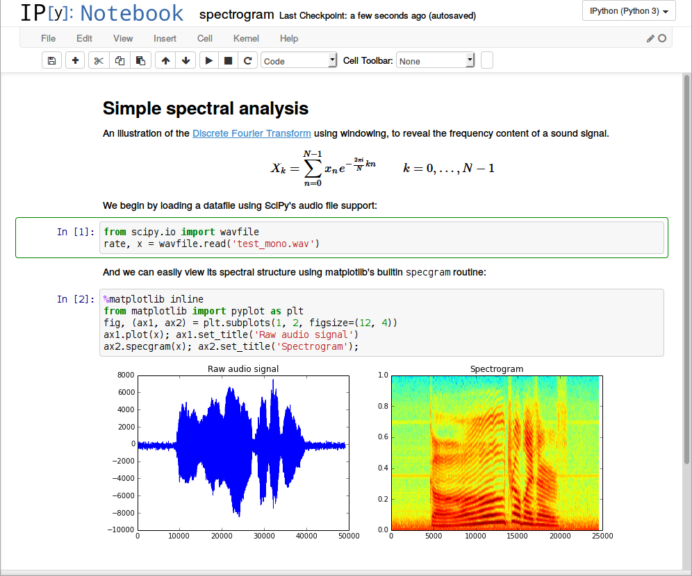

```{r setup, include=FALSE}
options(htmltools.dir.version = FALSE)
knitr::opts_chunk$set(
  fig.width=9, fig.height=3.5, fig.retina=3,
  out.width = "100%",
  cache = FALSE,
  echo = TRUE,
  message = FALSE, 
  warning = FALSE,
  hiline = TRUE
)
library(tidyverse)
library(htmltools)
library(gt)
tagList(rmarkdown::html_dependency_font_awesome())
```

```{r xaringan-themer, include=FALSE, warning=FALSE}
library(xaringanthemer)
style_duo_accent(
  primary_color = "#1381B0",
  secondary_color = "#FF961C",
  inverse_header_color = "#FFFFFF"
)
```
layout: true


.footercc[
<i class="fab fa-creative-commons"></i>&nbsp; <i class="fab fa-creative-commons-by"></i> <a href = "https://JohnLittle.info"><span class = "opacity30">https://</span>JohnLittle<span class = "opacity30">.info</span></a> 
<span class = "opacity30"> | <a href="https://github.com/libjohn/presentation_reproducible_computational_research">https://github.com/libjohn/presentation_reproducible_computational_research</a> | `r Sys.Date()` </span>
]

---
class: img-right-full


# Whoami


.absolute.t-30pct.f3[John Little  
Data Science Librarian  
Host of Rfun.library.duke.edu  
Center for Data & Visualization Sciences  ]

---
class: center
# Foundations of reproducible computational research

Data Analysis and Workflow Management 

--

## Reproducibility

--
_Reproducibility is about being as lazy as possible_  
.right[.f4.light-silver[-- Hadley Wickham]]

--

So you can recreate your environment as easily as possible

--

_Lazy in a good way_  
.f4.light-silver[-- Thomas Mock]


---
class: col-2

# Outline

```{r echo=FALSE}
fontawesome::fa(name = "tasks", fill = "#ffd960", fill_opacity = .8, height = "12em", width = "12em")
# fontawesome::fa_png(name = "tasks", file = "images/tasks.png", fill = "goldenrod", fill_opacity = .4, height = "5in")
```

<br>  
- Project Management
- Data Wrangling
- Literate Coding
- Analysis
  - Explanatory/Exploratory
  - Visualizing
  - Modeling
- Report products
- Archiving


---
# Data life cycle

Data ⇝ Information ⇝ Publish ⇶ Archive

> **Data** is _given._ **Information** is _taken._  
.right.f3.moon-gray[-- Daniel Kaplan. 2011.]


- **Data**: Recorded facts
- **Information**: a particular form of data well suited to communicate with humans and intended to guide conclusions, beliefs, decision, and action

---
class: col-2  

## Finding data  

Center for Data & Visualization Sciences  

AskData@Duke.edu

.center[
```{r echo=FALSE}
fontawesome::fa(name = "server", fill = "#a1b83a", fill_opacity = .8, height = "6em", width = "6em")
```
]

## YOUR data  
- Raw data sources  
- Ancillary data  

_Citeable, archived, transparent_

.center[
```{r echo=FALSE}
fontawesome::fa(name = "database", fill = "#a1b83a", fill_opacity = .8, height = "6em", width = "6em")
```
]  

---

<iframe width="1200" height="600" src="https://www.youtube.com/embed/N2zK3sAtr-4" title="YouTube video player" frameborder="0" allow="accelerometer; autoplay; clipboard-write; encrypted-media; gyroscope; picture-in-picture" allowfullscreen></iframe>


---

# _Project Management_ and file structure  

.absolute.w-4-12th.l-2-12th.t-20pct.pa2.br-4[
1. Data wrangling 
2. Analysis 
3. Visualization
4. Reporting 
5. Archiving
]

.absolute.w-6-12th.l-7-12th.t-3-12th.pa2.br-4[
```{r echo=FALSE}
fontawesome::fa(name = "route", fill = "#ef9921", height = "7em", width = "7em", fill_opacity = .8) 
```
]

<!-- .absolute.w-11-12th.l-1-12th.t-80pct.center[Use source code as the _workflow orchestrator_ to manage project elements ] -->

.center.absolute.t-80pct[Use source code as the _workflow orchestrator_ to manage project elements]

---

# Example: RStudio IDE with git version control

.absolute.w-10-12th.pa-3.l-1-12th.t-40pct.ba.bw-4.br-4[
```{r echo=FALSE}
# fontawesome::fa(name = "slash", fill = "white", height = "2em", width = "2em") 
fontawesome::fa(name = "r-project", fill = "#ef9921", height = "4em", width = "4em", fill_opacity = .8) 
fontawesome::fa(name = "plus", fill = "silver", height = "3em", width = "3em", fill_opacity = .6) 
fontawesome::fa(name = "git", fill = "#ef9921", height = "4em", width = "4em", fill_opacity = .8)  
fontawesome::fa(name = "plus", fill = "silver", height = "3em", width = "3em", fill_opacity = .6) 
fontawesome::fa(name = "github", fill = "#ef9921", height = "4em", width = "4em", fill_opacity = .6)  
fontawesome::fa(name = "slash", fill = "white", height = "2em", width = "2em") 
fontawesome::fa(name = "gitlab", fill = "#ef9921", height = "4em", width = "4em", fill_opacity = .6)
fontawesome::fa(name = "slash", fill = "white", height = "2em", width = "2em") 
fontawesome::fa(name = "bitbucket", fill = "#ef9921", height = "4em", width = "4em", fill_opacity = .6)  
```
]

---

# Version control and social coding hub

.absolute.w-10-12th.pa-3.l-1-12th.t-40pct.ba.bw-4.br-4[
```{r echo=FALSE}
# fontawesome::fa(name = "slash", fill = "white", height = "2em", width = "2em") 
fontawesome::fa(name = "r-project", fill = "white", height = "4em", width = "4em") 
fontawesome::fa(name = "plus", fill = "white", height = "3em", width = "3em") 
fontawesome::fa(name = "git", fill = "#ef9921", height = "4em", width = "4em", fill_opacity = .8)  
fontawesome::fa(name = "plus", fill = "silver", height = "3em", width = "3em", fill_opacity = .6) 
fontawesome::fa(name = "github", fill = "#ef9921", height = "4em", width = "4em", fill_opacity = .6)  
fontawesome::fa(name = "slash", fill = "white", height = "2em", width = "2em") 
fontawesome::fa(name = "gitlab", fill = "white", height = "4em", width = "4em")
fontawesome::fa(name = "slash", fill = "white", height = "2em", width = "2em") 
fontawesome::fa(name = "bitbucket", fill = "white", height = "4em", width = "4em")  
```
]

---

# Example project directory structure

.f4[ProjectName/
  - README.MD
  - Data/
    - Raw data/
    - Wrangled and cleaned data/
      - YYYY-MM-DDVersion(s)
      - Use version control ← Better than YYYY-MM-DD
  - Code | scripts/
    - Data cleaning/
    - Analysis
    - Models/
  - Output and report products/
    - Report products (R Markdown reports, slides, dashboards, MS Word, PDF, LaTex)
    - Graphs or images/
    - Tables
    - Publications
    - ebooks
    - .bib file]


---
# _Data Wrangling / Analysis_:

- Generate and manage data and analysis with code 
- Incorporate found and produced data into the same project
- Data wrangling (normalization & cleaning) as reproducible processes
- Protect personally identifiable information (PRDN)
- Relational database systems bring complexity: great power and administrative responsibility
- ♠♣ Tidy data ♦♥

##### Some good _reproducible_ data wrangling tool options:  

.center[OpenRefine ● R notebooks ● Jupyter notebooks]

---
## Tidy data definition  

- Every column is a variable  
- Every row is an observation  
- Every cell is a single value  

.center.f6[https://tidyr.tidyverse.org/articles/tidy-data.html#tidy-data ● https://r4ds.had.co.nz/tidy-data.html#tidy-data-1]

---

## Example Untidy data

```{r Untidy data, echo=FALSE}

tidyr::relig_income %>% slice_head(n = 6) %>% gt()

```

Problem?

--

Column headers are values, not variable names

---

## Example Tidy data

```{r wide data, echo=FALSE}
relig_income %>% 
  pivot_longer(2:last_col(), names_to = "income") %>% 
  arrange(income) %>% 
  slice_head(n = 6) %>% 
  gt() %>% 
    tab_header(
    title = "Religious income") %>% 
  tab_source_note("tidyr::relig_incom<br>Downloaded from https://www.pewforum.org/religious-landscape-study/ (downloaded November 2009)") %>% 
  tab_options(table.width = pct(90))
```


---
# _Literate coding_  

Combine code with prose and visualizations

- Use prose to explain analysis
	-  Structure your analysis and documentation
	  	- Markdown | R Markdown
-  Analysis AND report writing
	- Data code-books are part of the project
	- Render reports from code (_report products_)
---
class: img-caption  



.bg-washed-red.ba.bw-4.br-4[&nbsp; ↑ Example jupyter notebook ↑ &nbsp;]  
.f5[https://arogozhnikov.github.io/2016/09/10/jupyter-features.html]

---
# Visualize & spatial analysis
Use code-based tools  .f6[or tools with reproducible features]


---
# _Report products_

Leverage your literate coding

- Use rendered notebooks to _show your work_ .f3[without requiring the reader to reproduce the exact compute environment] 
  - .f3[Document all versions and session information]
- _Render (derived) reports_ from literate code documents
  - .f3[Generate slides, dashboards, documents, visualizations, books, PDFs, LaTeX, etc. from the same source code]

.center.bg-light-gray.ba.bw-4.br-4[Static and interactive documents work well with R Markdown literate coding ]


---
# _Archiving_

-  _Version Control_ = (Git) + Social Coding 
  - Social Coding Hubs = collaboration + self-documenting your project's story within a .bg-gold.pa1.br-4[code repository] .gray.f3[GitHub ● GitLab ● BitBucket]
-  .bg-gold.pa1.br-4[Archival repositories]  
	-  disciplinary v institutional
	-  data repositories 
	-  DOIs for output: Article, Code, etc. (i.e. Publishing)
	  - link to your ORCID
-  _Containers_: computational and archival representations of your project at various publishable milestones
  - Zero-install environment: does not require a _reader_ to set up a replica compute environment
  
---

# OSF

Open Science Framework

OSF is a free and open source project management tool that supports researchers throughout their entire project lifecycle.

https://OSF.io


---

# Related topics  

.pull-left[
### DOIs  

[](https://doi.org/10.5281/zenodo.4908855)

### Containers  
[](https://mybinder.org/v2/gh/libjohn/rfun_flipped/master?urlpath=rstudio)
]  

.pull-right[
### Author ID  

[](https://orcid.org/0000-0002-3600-0972)  

.absolute.w-5-12th.pa-3.l-7-12th.t-50pct[
```{r echo=FALSE}
fontawesome::fa(name = "orcid", fill = "#a1b83a", fill_opacity = .8, height = "4em", width = "4em") 
```
]  
]

---

# Licensing

- MIT for Software
- CC-BY for documents
- CC0 for data

[](https://creativecommons.org/licenses/by-nc-nd/4.0/)


.absolute.w-3-12th.pa-3.l-8-12th.t-10pct[
```{r echo=FALSE}
fontawesome::fa(name = "creative-commons-zero", fill = "#a1b83a", fill_opacity = .8, height = "3em", width = "3em") 
```

<i class="fab fa-creative-commons fa-3x"></i>  <i class="fab fa-creative-commons-by fa-3x"></i>

]


### Information about licensing
.f4[https://exygy.com/blog/which-license-should-i-use-mit-vs-apache-vs-gpl/  
https://arstechnica.com/gadgets/2020/02/how-to-choose-an-open-source-license/  
https://creativecommons.org/  
]  

### Office of Copyright and Scholarly Communications
.f4[https://library.duke.edu/about/depts/scholcomm]


---
background-image: url("images/Project Foundation Pyramid.svg")

##### Reproducible Project Pyramid 

---
layout: false
class:  middle, center

<br>

.bg-washed-blue.b--navy.ba.bw2.br3.shadow-5.ph4.mt5[


## John R Little

.seagull[
.f5[Data Science Librarian  
Center for Data & Visualization Sciences  
Duke University Libraries  
]
]

.f7[https://johnlittle.info  
https://Rfun.library.duke.edu  
https://library.duke.edu/data  
]
]


<i class="fab fa-creative-commons fa-2x"></i> &nbsp; <i class="fab fa-creative-commons-by fa-2x"></i><br> 
.f6.moon-gray[Creative Commons:  Attribution 4.0]  
.f7.moon-gray[https://creativecommons.org/licenses/by-nc/4.0]


